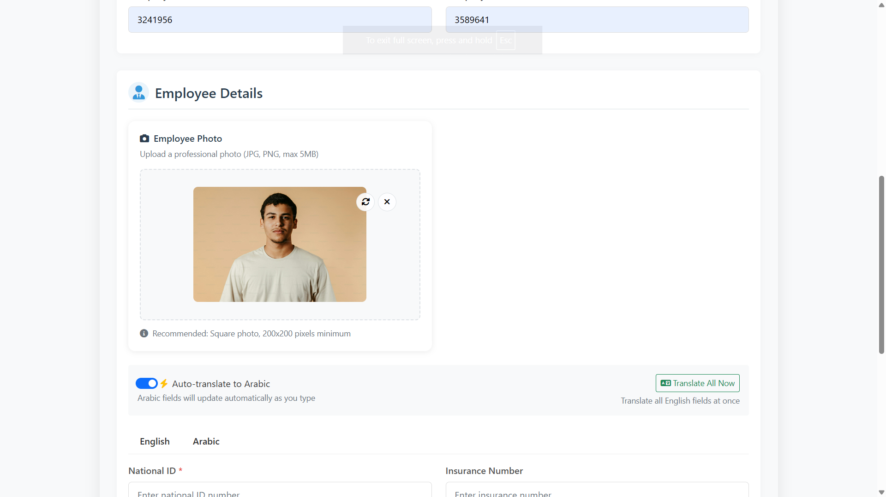

# MaxAB HR ERP System

A comprehensive Human Resources Enterprise Resource Planning system built with Spring Boot for managing employee contracts, information, and HR operations.
Features
## Core HR Management

   - Employee Management: Complete employee lifecycle management

   - Contract Generation: Automated professional contract creation

   - Document Management: Insurance papers and employment documents

   - Employee Profiles: Detailed employee information with photo support

## Modern User Interface

   - Responsive Design: Works seamlessly on desktop, tablet, and mobile

   - Modern Dashboard: Real-time HR metrics and quick actions

   - Arabic & English Support: Bilingual interface with RTL support

   - Professional Styling: Clean, modern design with MaxAB branding

## Advanced Functionality

   - Search & Filter: Real-time employee search capabilities

   - Data Export: Generate contracts and insurance documents

   - Bulk Operations: Manage multiple employees efficiently

   - Statistics & Analytics: HR metrics and reporting

## Technology Stack
# Backend

   - Java 17 - Core programming language

   - Spring Boot 3.5.6 - Application framework

   - Spring Data JPA - Database operations

   - PostgreSQL - Primary database

   - Thymeleaf - Server-side templating

# Frontend

   - Bootstrap 5 - Responsive UI framework

   - Font Awesome 6 - Icons and visual elements

   - Custom CSS - Professional styling

   - JavaScript - Interactive functionality

## Development Tools

   - Maven - Dependency management

   - Spring Boot DevTools - Development utilities

## Key Features
# Employee Management

   - Add, view, edit, and delete employees

   - Employee photo upload support

   - Bilingual employee information (English & Arabic)

   - Advanced search and filtering

# Contract System

   - Professional contract generation

   - Bilingual contract templates

   - PDF export functionality

   - Customizable contract fields

# Document Management

   - Insurance document generation

   - Employee document storage

   - Photo management system

   - Bulk operations

## Screen Shots

## License

## Copyright (c) 2025 Andrew Ashraf

This software was developed by **Andrew Ashraf** as a personal learning project and a customized HR ERP system inspired by internal requirements at MaxAB.  
It is **not officially affiliated with or endorsed by MaxAB.**

The software is **proprietary and protected by copyright.**
All rights are reserved by the author, Andrew Ashraf.

Permission is granted to view and reference the source code for **educational and personal review purposes only.**
**Commercial use, reproduction, modification, distribution, or sale** of this software or any part of it is **strictly prohibited without the express written permission** of the copyright holder.

Unauthorized use of this software is a violation of intellectual property rights and may be subject to legal action.

**Disclaimer:**
**THE SOFTWARE IS PROVIDED "AS IS", WITHOUT WARRANTY OF ANY KIND, EXPRESS OR IMPLIED, INCLUDING BUT NOT LIMITED TO THE WARRANTIES OF MERCHANTABILITY, FITNESS FOR A PARTICULAR PURPOSE, AND NON-INFRINGEMENT. IN NO EVENT SHALL THE AUTHOR BE LIABLE FOR ANY CLAIM, DAMAGES, OR OTHER LIABILITY, WHETHER IN AN ACTION OF CONTRACT, TORT, OR OTHERWISE, ARISING FROM, OUT OF, OR IN CONNECTION WITH THE SOFTWARE OR THE USE OR OTHER DEALINGS IN THE SOFTWARE.**

